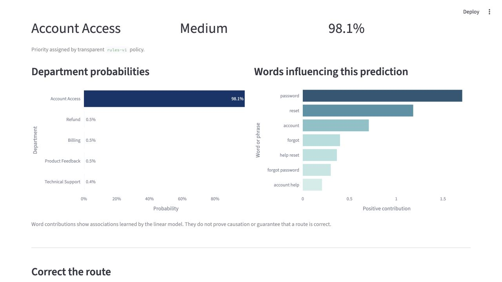

# SupportFlow AI

SupportFlow AI is an interpretable customer-support ticket router built with
classical NLP. It predicts one of five departments, assigns a transparent
priority, exposes confidence and influential words, sends uncertain tickets to
human review, and captures corrections for later retraining.



## Features

- Routes to Billing, Technical Support, Account Access, Refund, or Product Feedback
- Compares TF-IDF logistic regression with TF-IDF multinomial Naive Bayes
- Reports accuracy, macro-F1, per-class metrics, and a confusion matrix
- Uses a validation-tuned 0.80 confidence threshold for human review
- Explains predictions with local TF-IDF × coefficient contributions
- Assigns priority with auditable rules rather than unsupported urgency labels
- Saves redacted corrections with the model version
- Includes automated tests and GitHub Actions

## Results

| Model | Validation accuracy | Validation macro-F1 |
| --- | ---: | ---: |
| Logistic regression | 0.998 | 0.999 |
| Multinomial Naive Bayes | 0.993 | 0.994 |

The selected logistic-regression router achieved **0.998 test accuracy** and
**0.998 test macro-F1** on an untouched 1,774-ticket test set.

At the 0.80 review threshold:

- Test auto-routing coverage: 96.0%
- Test human-review rate: 4.0%
- Accuracy among auto-routed test tickets: 100.0%
- All four test errors were captured by human review

These scores reflect a generated, strongly templated intent dataset. They must
not be interpreted as expected performance on a company's real tickets. See the
[model card](reports/MODEL_CARD.md), [data audit](reports/DATA_AUDIT.md),
[metrics](reports/metrics.json), and
[error-analysis sample](reports/error_analysis.csv).

## How it works

```text
Customer text
    ↓
Privacy cleaning and normalization
    ↓
TF-IDF unigrams + bigrams
    ↓
Multiclass logistic regression
    ↓
Confidence ≥ 0.80? ── no ─→ Human Review
    │
   yes
    ↓
Predicted department
    ↓
Rule-based priority + word contributions + correction form
```

The model pipeline keeps TF-IDF and the classifier together, preventing
training-serving preprocessing drift. Department labels and agent responses
are never included as features.

## Data

The project uses a focused subset of the Bitext Retail & E-commerce Customer
Support Dataset under CDLA-Sharing-1.0. The processed dataset contains 11,823
unique cleaned messages:

| Department | Tickets |
| --- | ---: |
| Product Feedback | 2,977 |
| Refund | 2,935 |
| Billing | 2,933 |
| Technical Support | 1,986 |
| Account Access | 992 |

The source file is intentionally excluded from Git. The download script pins
the audited source revision and verifies the parquet checksum.

## Local setup

Use Python 3.11:

```bash
python3.11 -m venv .venv
source .venv/bin/activate
python -m pip install --upgrade pip
python -m pip install -r requirements.txt
python scripts/download_data.py
python scripts/prepare_data.py
python scripts/train.py
python -m pytest
streamlit run app.py
```

The trained model and published evaluation artifacts are already included, so
`streamlit run app.py` works immediately after dependency installation.

## Repository structure

```text
app.py                     Streamlit interface
src/data.py                Validation, cleaning, and label construction
src/modeling.py            Pipelines, metrics, and threshold selection
src/inference.py           End-to-end routing
src/explain.py             Linear feature contributions
src/priority.py            Transparent urgency rules
src/feedback.py            Append-only correction capture
scripts/download_data.py   Versioned, checksum-verified data download
scripts/prepare_data.py    Processed dataset and audit generation
scripts/train.py           Splitting, comparison, evaluation, and artifacts
tests/                      Unit and integration tests
reports/                    Data audit, metrics, errors, and model card
```

## Testing

```bash
python -m pytest
```

Tests cover schema validation, PII cleaning, department construction,
probability behavior, threshold selection, priority rules, saved-model
inference, explanations, and correction persistence. GitHub Actions runs the
same suite for every push and pull request.

## Responsible-use controls

- Tickets below the confidence threshold are not auto-routed.
- Priority is rule-based and displays the triggering phrase when one matches.
- Explanations are described as learned associations, not causal reasons.
- Common emails, URLs, long numbers, and template entities are normalized.
- Corrections do not silently retrain or alter the live model.
- The UI warns users not to enter passwords or full payment-card numbers.

For a live deployment, correction files stored on Streamlit Community Cloud
should be treated as temporary. Use a durable database before collecting real
operational feedback.

## Deployment

1. Push this repository to a public GitHub repository.
2. Sign in to Streamlit Community Cloud with GitHub.
3. Create an app and select `app.py` as the entrypoint.
4. Match the deployment runtime to Python 3.11.
5. Test routing, human review, charts, and correction download on the live URL.

## Future improvements

- Collect and human-label real tickets from the target business domain
- Add probability calibration and monitor confidence drift
- Expand Account Access beyond password recovery
- Add a durable feedback database and reviewer workflow
- Retrain only after correction quality checks and dataset versioning
- Compare character n-grams for typo robustness
